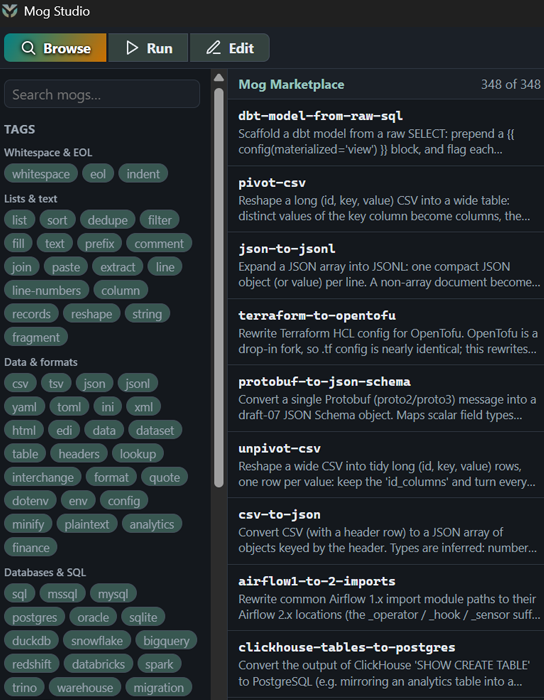

# Mog Studio

A desktop GUI for the Mog text-transform engine. Build, preview, and run `.mog`
pipelines with a schema-driven form for every action, a live diff, and batch runs
across many files.

**Windows only.** The installer, the Add/Remove Programs entry and the PATH
handling are all Windows-specific, and rendering uses the Edge WebView2 runtime
that ships with Windows.



## What it does

- **Build a recipe without memorising the format.** Every action renders as a
  form generated from its schema, so the available options and their types come
  from the engine rather than from documentation that can drift.
- **See the change before making it.** A live diff shows exactly what a step
  would do to the current input, updated as you edit.
- **Run across many files at once**, with an impact summary per file before
  anything is written.
- **Test recipes against their goldens** and check that a recipe would leave a
  set of files unchanged.
- **Browse and install shared recipes** from the Mog marketplace.
- **A regex tester in the engine's exact flavour**, so a pattern that works in
  the tester works in a recipe.

Built with Tauri v2 (Rust) and Svelte 5 (runes) + TypeScript + Vite.

## Privacy

Studio does not collect analytics, telemetry or crash reports, and has no
account or sign-in.

It reads and writes the files you point it at, and it talks to the network only
when you browse the marketplace or check for updates. Both of those run in the
Rust process, not in the page.

This is enforced rather than asserted: `src-tauri/capabilities/default.json`
grants the webview only the core, dialog and filesystem permissions. There is no
shell permission and no HTTP permission, so the page cannot run a command or
open a network connection of its own.

## How it ships

Mog Studio ships as a single portable `.exe`. The `mog` engine binary is embedded
inside it (gzip-compressed, baked in at build time), so there is nothing else to
download.

On first launch from outside its install directory, Studio shows an installer
card: it copies itself into a per-user location, extracts the engine next to it,
and lets the engine register itself (PATH, recipe library, MCP server, and the
Add/Remove Programs entry). Everything is per-user, so no administrator rights
are needed.

At runtime Studio drives the engine as a subprocess (it does not link it as a
library). The binary is resolved in this order:

1. `MOG_BIN` (explicit override, handy in development),
2. `mog.exe` next to the Studio executable (the installed layout),
3. `%LOCALAPPDATA%\mog\mog.exe`,
4. `mog` on `PATH`.

## Prerequisites

- Node.js and npm.
- Rust >= 1.77.2 with the MSVC toolchain (`x86_64-pc-windows-msvc`).
- WebView2 runtime on Windows (preinstalled on current Windows 11).
- For the regex tester: `wasm-pack` and the `wasm32-unknown-unknown` target.

  ```bash
  rustup target add wasm32-unknown-unknown
  cargo install wasm-pack
  ```

Build on a local (non-synced) folder. Building inside a cloud-synced folder can
break Rust and `node_modules` builds through file locking.

## Develop

The WASM regex tester is a build prerequisite: `src/wasm/regex` is generated, not
checked in, so run `build:wasm` once before the first dev or build run (and again
after changing anything under `regex-wasm/`).

```bash
npm install
npm run build:wasm
npm run tauri dev
```

## Checks

```bash
npm run check
npm run build
```

## Build a shippable exe

A plain `npm run tauri build` produces a Studio build with **no embedded engine**:
it runs against an engine found on the machine, and its installer card will refuse
to install. To produce the real single-file download, the engine binary has to be
built and staged first. The owner's ship script (`build-ship.ps1`) does this end to
end, but it lives outside this repository, so a fresh clone reproduces it manually:

1. `cargo build --profile dist --bin mog` in `mog-rs/`.
2. Copy `mog-rs/target/dist/mog.exe` to `studio/src-tauri/binaries/mog-dist.exe`
   (or point `MOG_DIST_EXE` at it; `build.rs` honours either).
3. `npm run build` then `npx tauri build --no-bundle` in `studio/`.

The result is `studio/src-tauri/target/release/mog-studio.exe`, the single-file
installer. Signed release manifests are emitted separately by the `market-admin`
binary (`engine` and `studio` subcommands).

## License

MIT. See [LICENSE](LICENSE).
